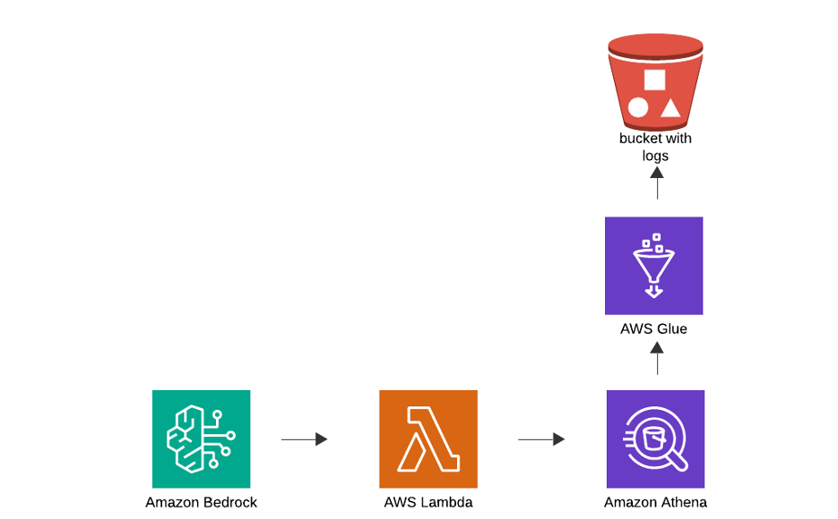

# Bedrock Agents Security Log Summarizer Demo
This demo shows the use of Amazon Bedrock Agents to allow natural language queries of security logs, using AWS Glue and Amazon Athena to retrieve the information stored in a S3 bucket, and Claude 3 Haiku as the LLM powering Bedrock Agents. 

## Disclaimer
This code is for demonstration purposes only, some of the IAM roles are overly permissive and not meant for production use.

## Architecture


## Deployment

### Enable LLM model
Before Bedrock LLM models can be used, they need to be enabled. This only needs to be done once per AWS account.

On the AWS console, go to Bedrock, scroll down and at the left bottom of the page, click on "Model Access" and select to enable "Claude 3 Haiku". 

### Deploy Infrastructure 

There are two CloudFormation templates provided, to get around the circular dependencies between the AWS Lambda function and Amazon Bedrock. A bash script is used to orchestrate this deployment and upload the sample files.

Go to the AWS console, open a terminal, clone or upload this repository, and run:
```
cd infrastructure
./deploy_infrastructure.sh
```

## Testing
Go to AWS Console > Bedrock > Agents and paste one of the questions from the file _questions.txt_. You can validate the responses by checking the values in the _data_ folder.

## Next Steps
In order to extend the functionality of this agent, you can edit the Lambda function in _infrastructure/lambda_function.py_ and update the deployment.

## Deleting
The deployment script will also generate a _delete_infrastructure_updated.sh_. This can be used to delete the created resources once you are done.

Run:
```
chmod +x delete_infrastructure_updated.sh
./delete_infrastructure_updated.sh
```
If you receive an error message, you might need to manually delete the Athena workgroup. In order to do that, go to the AWS Console > Athena > Administration > workgroups and delete "SecurityDemoAthenaWorkgroup". Then go to CloudFormation > Stacks and delete the related stack.

### Note on Deleting
The above deletion script should remove all resources in the case of a successful deployment.

If your deployment failed (as an example if you didn't enable the Bedrock model), the CloudFormation stack will fail to delete. In order to do that:
- Delete all objects from the bedrock-agent-lambda and the glue-logs s3 bucket
- Delete the Athena workgroup, if it exists.  In order to manually do that, go to the AWS Console > Athena > Administration > workgroups and delete "SecurityDemoAthenaWorkgroup".
Once these steps are completed, you should be able to execute the CloudFormation stack delete.

## Security

See [CONTRIBUTING](CONTRIBUTING.md#security-issue-notifications) for more information.

## License

This library is licensed under the MIT-0 License. See the LICENSE file.

